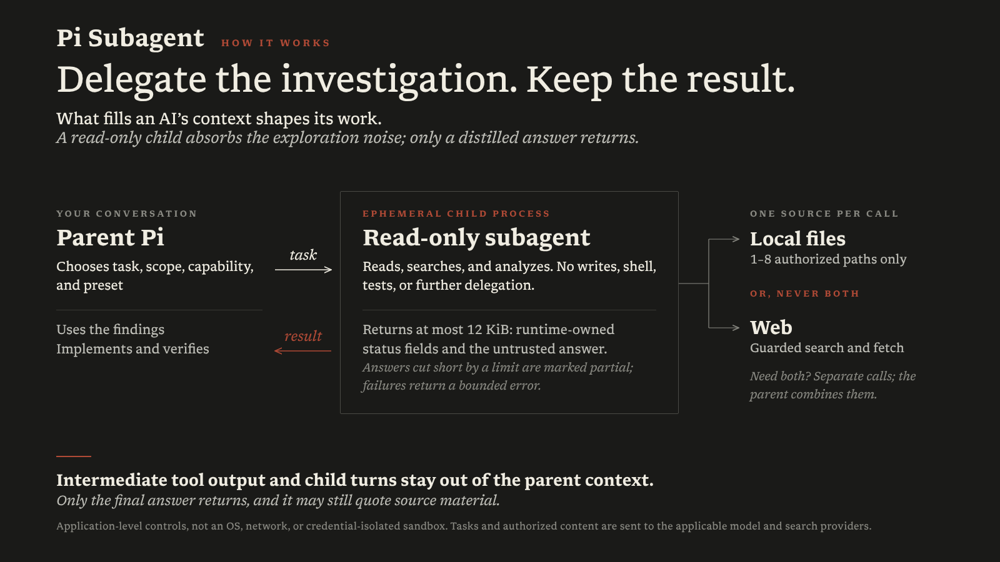

# Pi Subagent

[](https://www.npmjs.com/package/@mdgchamomile/pi-subagent)
[](https://www.npmjs.com/package/@mdgchamomile/pi-subagent)
[](LICENSE)

Run focused, bounded investigations in an ephemeral child Pi process while keeping intermediate tool output out of the parent context.

`@mdgchamomile/pi-subagent` bundles two parts that work together:

- **`pi_subagent` extension** — enforces scope, tool ownership, resource budgets, lifecycle, telemetry, and output boundaries.
- **Companion skill** — guides the parent in deciding when to delegate and selecting the appropriate capability and model preset.

### See it in action

An illustrated CLI walkthrough of Pi Subagent's delegation workflow. The example uses a synthetic retry bug; dialogue, timing, and usage figures are illustrative rather than a recording of a live model session.

**Model invoked** — ask a normal question. When a focused investigation is appropriate, Pi can select the skill and delegate the investigation to a scoped, read-only child. You can also invoke `/skill:pi-subagent` explicitly with a focused task and scope; the parent follows the skill guidance and calls the same `pi_subagent` tool.


In either case, intermediate child reads stay out of the parent context. The child investigates only; implementation, tests, and final verification remain with the parent.

## Why use it?

Investigations can fill the main conversation with file reads, searches, fetched pages, and exploratory reasoning. Pi Subagent moves that work into a foreground child process and returns only its bounded final answer.

- **Keep context focused** — discard intermediate child turns and tool results while the parent handles decisions and final verification.
- **Limit access explicitly** — authorize 1–8 local paths or use a separate web-only capability; local and web tools never coexist in one child.
- **Bound execution** — cap runtime, tool calls, web requests, and final output while reporting progress and partial results visibly.
- **Load guidance only when needed** — progressively disclose the bundled skill instead of adding the full workflow to every prompt.

## Install

Requirements:

- Linux, including Ubuntu on WSL; native Windows is not officially supported or tested;
- Pi 0.87.1 or later;
- authentication for the configured child provider and access to its model (`openai-codex` by default; see [Presets](#presets));
- `rg` for local `grep`, and `fd` or `fdfind` for local `find`.

> [!IMPORTANT]
> This package provides an application-level capability boundary, not an OS, network, or credential-isolated sandbox. Pi extensions execute with the current user's system permissions. Review the source and trust assumptions before installing it.

```bash
pi install npm:@mdgchamomile/pi-subagent
```

Restart Pi or run `/reload`. The model can select the skill automatically. To invoke it explicitly, include a focused task and scope. For example, from a project with a `src/` directory:

```text
/skill:pi-subagent Investigate how cancellation terminates child processes within src/. Return conclusions with file and line evidence.
```

This command gives delegation guidance to the parent, which then calls the `pi_subagent` tool. The child investigates only: it does not modify files or run tests, and final verification remains with the parent.

### Optional web capability

Local investigations work with this package alone. Web investigations require `pi-web-access` v0.33.0 or later (stable releases) with its default tool names:

```bash
pi install npm:pi-web-access
```

Newer stable versions are allowed without an upper bound, not guaranteed compatible; upstream behavior changes may require maintenance. Package provenance checks, argument allowlists, and execution limits remain enforced. Without that dependency, local runs remain available.

## How it works

1. The parent delegates one focused task with a capability, explicit scope, and preset.
2. The parent extension canonicalizes the authorized scope and starts an ephemeral `pi --mode json --print --no-session` child process.
3. The child guard validates tool ownership, publishes a private readiness marker, and validates each local or web tool call before execution.
4. The child investigates within its time and resource budgets. The parent-side collector excludes intermediate messages and verifies readiness after the child exits before accepting its final answer.
5. The parent model context receives a bounded JSON envelope with runtime-owned `status`, `partialReason`, and `outputTruncated` fields plus the untrusted child `answer`. `partialReason` identifies an incomplete result caused by a tool budget, investigation deadline, or model output limit; `outputTruncated` separately indicates byte-cap truncation. The entire envelope fits within the output cap. Content-free execution and budget metadata remain in host-only tool-result details without tasks, paths, queries, URLs, or tool content.

[](extensions/pi-subagent/assets/pi-subagent-architecture.png)

Collection, control-character sanitization, and result assembly run in the parent extension. Complete/partial calls return bounded answer text and separate host-only metadata; failures return bounded error text. Sanitization does not redact source quotations from the final answer. `--no-session` disables persisted Pi sessions, not in-memory context or private runtime files.

The child cannot write files, run Bash or tests, persist a session, or recursively launch more agents. Final validation and any implementation stay with the parent.

## Capabilities

| Capability | Available tools | Scope |
| --- | --- | --- |
| `local` | Pi-owned `read`, `grep`, `find`, and `ls` | 1–8 existing paths inside the parent working directory |
| `web` | Guarded tools from `pi-web-access` v0.33.0 or later (stable releases) | Empty; no local-file access |

Mixed local-and-web work uses separate child calls, with synthesis performed by the parent.

## Presets

| Preset | Provider/model ID | Thinking | Best for |
| --- | --- | --- | --- |
| `lookup-standard` | `openai-codex/gpt-5.6-luna` | `medium` | Bounded fact-finding |
| `analysis-standard` | `openai-codex/gpt-6-sol` | `medium` | Synthesis and causal comparison |
| `review-standard` | `openai-codex/gpt-6-sol` | `high` | Adversarial review |

These are **default settings**, not required providers or models. They do not inherit the parent model or change its thinking level.

Run **`/pi-subagent-settings`** in Pi's TUI to select a preset, provider, model, and supported thinking level, then confirm the change. Type to search by ID or display name; bounded lists scroll with the arrow keys and mark the current setting. Escape returns to the previous selection step (or exits the first); Ctrl+C cancels. Nothing is saved until confirmation. The picker lists models Pi considers available from local authentication metadata, not verified account access; you can still configure other registered models in the settings file. Saving makes no provider request and does not guarantee child access. Defaults persist across sessions and apply to the next subagent call without a reload; running children and the parent model are unchanged.

You can also edit individual presets in `~/.pi/agent/pi-subagent.json` (or under `PI_CODING_AGENT_DIR`, resolved by Pi's `getAgentDir()`):

```json
{
  "presets": {
    "analysis-standard": {
      "provider": "anthropic",
      "model": "claude-sonnet-4-5",
      "thinking": "high"
    },
    "review-standard": {
      "provider": "openrouter",
      "model": "anthropic/claude-sonnet-4.5",
      "thinking": "high"
    }
  }
}
```

Use exact model IDs available in your Pi registry; examples do not grant access. Settings are read before each call, and omitted presets/fields keep their defaults. Set `provider` and `model` together; a thinking-only override is allowed. Supported thinking names are `off`, `minimal`, `low`, `medium`, `high`, `xhigh`, and `max`, restricted to what Pi reports for that model. Invalid settings, missing models, or unsupported thinking fail before child startup; there is no automatic fallback. Confirm access to the selected model, or configure an available model with `/pi-subagent-settings`.

Authenticate each provider through Pi, not this file. Only user-level settings are read; project files and tool arguments cannot override the selection. Child extensions remain disabled, so providers registered only by a parent extension are not supported. The child checks its effective model and thinking before sending requests to prevent silent selection changes. See the [extension guide](extensions/pi-subagent/README.md#presets) for configuration details.

## Security and data flow

Authorized local-file contents, web tasks and queries, fetched pages, and the final answer may be sent to the applicable configured model or search providers. Do not delegate secrets that must not leave the host or use the package for untrusted workloads requiring host isolation.

The runtime canonicalizes local paths, blocks lexical and symlink escapes, verifies tool provenance, and sanitizes control characters in returned text. After the child exits, the parent verifies the guard's private readiness marker before accepting its final answer.

## Documentation

- [extension guide](extensions/pi-subagent/README.md) — complete runtime, installation, security, and verification contract.
- [skill guide](skills/pi-subagent/README.md) — when delegation is appropriate and how the workflow selects a child.
- [Source repository](https://github.com/MDGChamomile/pi-subagent)
- [Issue tracker](https://github.com/MDGChamomile/pi-subagent/issues)
- [Contributing](CONTRIBUTING.md) — development setup and offline verification.
- [Package maintenance](packaging/pi-subagent/DEVELOPMENT.md) — package assembly and release procedures.
- [Migration](MIGRATION.md) — existing npm and source installations.
- [Design principles](PRINCIPLE.md) — local pointer to the [canonical principles](https://github.com/MDGChamomile/MDGChamomile/blob/main/PRINCIPLE.md).

## License

[MIT](LICENSE)
