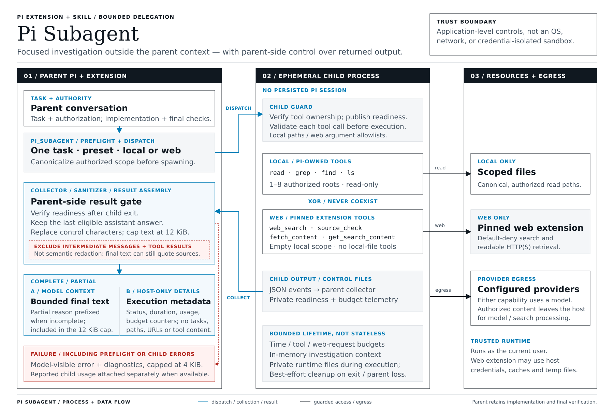

# Pi Subagent

A foreground, model-invocable Pi extension that runs focused local-file or web investigations outside the parent context.

The companion [skill](../../skills/pi-subagent/README.md) decides when and how to delegate. This extension enforces the runtime boundary, launches the child, reports progress, and returns only the bounded final answer.

[Install](#requirements-and-installation) · [Runtime contract](#runtime-contract) · [Security](#security-boundary) · [Evaluation](#evaluation) · [Verification](#verification)

## Highlights

- Keeps intermediate child turns and tool results out of the parent context.
- Restricts local runs to explicit read-only paths and keeps local and web capabilities separate.
- Bounds runtime, tool calls, web requests, and returned output.
- Reports live progress, completion status, usage, and estimated injected context in the TUI.
- Handles partial results, cancellation, timeouts, and parent termination explicitly.

## In action

These screenshots show a real local lookup against this repository. Machine-specific paths and account details were removed from the rendered output.

**Running — elapsed time, child model, thinking level, and reported tokens**


**Complete — completion time, injected context size, and expanded final answer**


## Requirements and installation

Core requirements:

- Linux, including Ubuntu on WSL; native Windows is not officially supported or tested;
- Pi 0.84.2 or later;
- authentication for Pi's `openai-codex` provider and access to the selected child model listed under [Presets](#presets). Installing this extension does not grant model access.

Capability-specific requirements:

- `local`: `rg` for `grep`, and `fd` or `fdfind` for `find`;
- `web`: [`pi-web-access` v0.27.0](https://github.com/nicobailon/pi-web-access) with its default tool names.

Install the extension and companion skill together from npm:

```bash
pi install npm:@mdgchamomile/pi-subagent
```

For web investigations, also install the exact reviewed web extension version:

```bash
pi install npm:pi-web-access@v0.27.0
```

Alternatively, install both components from a checkout:

```bash
git clone https://github.com/MDGChamomile/pi-agent-kit.git
cd pi-agent-kit
mkdir -p ~/.pi/agent/extensions ~/.pi/agent/skills
ln -s "$PWD/live/extensions/pi-subagent" ~/.pi/agent/extensions/pi-subagent
ln -s "$PWD/live/skills/pi-subagent" ~/.pi/agent/skills/pi-subagent
```

Restart Pi or run `/reload`. The model can then select the skill automatically, or the user can invoke `/skill:pi-subagent`.

> [!NOTE]
> The web guard verifies the dependency's package name, exact version, declared entry point, and tool provenance, so another version or extension exposing the same tool names does not satisfy it. The exact pin prevents unreviewed code drift on reinstall; it does not by itself prove package safety. Without the web dependency, `local` runs remain available. Local child startup is forced offline and never downloads missing search binaries.

## How it works

1. The parent calls `pi_subagent` with one focused task, a capability, an explicit scope, and a preset.
2. The parent extension canonicalizes the authorized scope and starts one ephemeral `pi --mode json --print --no-session` child process.
3. The child guard validates tool ownership, publishes a private readiness marker, and validates each local or web tool call before execution.
4. The parent-side collector discards intermediate child turns and tool results. After the child exits, the parent verifies readiness before accepting the last valid non-tool assistant answer, sanitizing control characters, and limiting its size.
5. The TUI reports per-call progress and, when settled, the elapsed time and estimated context injected into the parent.

[](assets/pi-subagent-architecture.png)

Collection, control-character sanitization, and result assembly run in the parent extension. Complete/partial calls return bounded answer text and separate host-only metadata; failures return bounded error text. Sanitization does not redact source quotations from the final answer. `--no-session` disables persisted Pi sessions, not in-memory context or private runtime files.

One child call is the default. Up to three distinct, independent calls may run in parallel during one parent agent run; local and web calls each count toward that limit and can multiply model, provider, and web-request usage. One corrected retry is allowed only after preflight validation fails.

## Runtime contract

### Capabilities and scope

- `local` loads only Pi-owned `read`, `grep`, `find`, and `ls`. It requires 1-8 existing files or directories inside the parent working directory.
- `web` loads only `web_search`, `source_check`, `fetch_content`, and `get_search_content` from the installed `pi-web-access` package. Its scope must be empty.
- Local and web access never coexist in one child. Mixed-source work uses separate calls and parent-side synthesis.
- A bare `@` is rejected rather than expanding to the parent working directory.
- The child cannot write files, run Bash or tests, inspect sessions, recurse, run in the background, persist a child session, or load discovered extensions, Skills, prompt templates, context files, themes, or project trust.

### Presets

Each standard preset chooses a proportionate child model without changing the main model's thinking level:

| Preset | Provider/model ID | Thinking | Use for |
| --- | --- | --- | --- |
| `lookup-standard` | `openai-codex/gpt-5.6-luna` | `medium` | Bounded fact-finding |
| `analysis-standard` | `openai-codex/gpt-5.6-terra` | `medium` | Synthesis and causal comparison |
| `review-standard` | `openai-codex/gpt-5.6-sol` | `medium` | Adversarial review |

These mappings are fixed in the extension; they do not inherit the parent model or fall back to another provider. The selected model must be present in Pi's model registry and accessible to your authenticated account. If it is absent from the registry, the call fails during preflight with `Configured subagent model is unavailable`.

Older stored calls with separate `profile` and `thinking` arguments, or with the former balanced/deep/exhaustive preset names, are translated to the matching standard preset before schema validation.

### Result and lifecycle

The runtime applies these per-child limits:

| Limit | `local` | `web` |
| --- | --- | --- |
| Investigation deadline | 18 minutes, then a 2-minute text-finalization window within the 20-minute hard limit | Same |
| Tool-call budget | Warn at 36 attempts; stop before attempt 49 | Warn at 30 attempts; stop before attempt 41 |
| Executed web queries | — | 32 |
| Executed fetch/content targets | — | 50 |
| Final answer | 12 KiB | 12 KiB |

- The parent accepts a final answer only after the child guard validates policy and tool ownership and publishes its readiness marker.
- Intermediate assistant turns and investigation tool results are discarded. The collector retains only the last assistant message containing non-empty text without a tool call or terminal model error, then sanitizes and bounds it.
- A tool-only or token-limited ending gets at most one tool-disabled finalization follow-up. A zero-exit child that still has no final answer is rejected.
- Each running call reports `mm:ss · model (thinking) running · N reported tokens` once per second. A settled row reports `✓ Complete · 14.2s · Context injected: ~1,820 tokens`, or `⚠ Partial`; expanding it reveals the answer.
- Answers completed during the text-finalization window are labelled `partial` with `partialReason: "time_limit"`; an unresponsive child is terminated at the hard deadline.
- If the last answer still has `stopReason: "length"`, its available text is returned as `partial` with `partialReason: "model_length"`, never as complete. This reason takes precedence over a simultaneous budget or time limit. `outputTruncated` continues to report only truncation by the runtime's byte cap.
- Allowed and denied tool attempts both count. A soft warning leaves later calls available; a hard stop disables tools, reuses text finalization, and returns a `partial` result with `partialReason: "tool_budget"`.
- Web calls reserve their full cost synchronously during sequential Pi tool preflight, before parallel execution: `web_search` charges its normalized `query`/`queries`; `source_check` charges its effective queries and, with `fetchContent: true`, conservatively up to five result pages (`min(5, queries × results per query)`); `fetch_content` charges its normalized unique `url`/`urls`; and each `get_search_content` retrieval charges one content target. A batch that would cross either limit does not execute or consume query/fetch counters.
- Only the bounded final-answer text (`content`) enters the parent model context. Partial results start with `[Subagent partial: REASON]`, where `REASON` is `tool_budget`, `time_limit`, or `model_length`; complete results have no added prefix. The prefix is included within the 12 KiB cap and the injected-context estimate, so the parent can recognize an incomplete result without relying on the child's wording. Parent tool-result `details` retain content-free execution and budget metadata for the UI and host, such as the selected capability, preset, model, scope-root count, status, duration, usage, limits, and counters. They are not sent to the parent model and never include tasks, queries, URLs, paths, or tool content.
- A dedicated parent-liveness pipe makes the child remove private runtime files and terminate its POSIX process group if the parent exits abruptly. The implementation has a native-Windows fallback that terminates the child process itself, but native Windows is not officially supported or tested.
- Final diff, audit, test, and retrieval validation stays with the parent when it holds the edited files or may need to make follow-up fixes.

## Security boundary

### Local runs

The child guard canonicalizes every requested path, replaces the tool input with that authorized canonical path, and blocks paths outside the explicit scope, including lexical, absolute, and symlink escapes. It independently verifies that every enabled local tool is Pi-owned. Local runs do not resolve or load the web extension.

### Web runs

The web extension loads before the guard, making the guard the final `tool_call` policy handler. Every web tool uses a pinned, default-deny argument allowlist:

- searches are non-interactive, use the configured provider, disable curation and background content expansion, and allow at most four queries with ten results each;
- fetches allow at most five readable HTTP(S) URLs under the web extension's SSRF policy;
- caller-selected providers or proxies, local files, browser-cookie authentication, answer/model/media modes, embedded URL credentials, and forced GitHub clones are rejected.

A denied input blocks only that call, allowing the child to correct it. Every corrected call is validated independently.

### Trust model and data flow

If policy or ownership validation fails, no readiness marker is published and the parent rejects any assistant text the child may still produce. Errors returned to the parent are control-character-sanitized and capped at 4 KiB; failure diagnostics omit tasks, paths, assistant text, and tool-result contents. Child stderr is discarded, while reported child usage is attached to the parent tool result on success and failure.

Authorized local file contents, web tasks and queries, fetched web pages, and the final answer are sent to the applicable model or search providers. The trusted web extension may maintain its documented bounded cache or temporary files.

This is an application-level capability boundary, not an OS or network sandbox. The child and trusted web extension still run as the current user. The `web` capability restricts the available tool names and arguments; it does not guarantee anonymous, public-only target access or isolate host GitHub, Git, SSH, or browser credentials that the trusted web extension may use. Do not use it for untrusted workloads requiring host isolation or for secrets that must not be sent to configured providers.

## Evaluation

From the repository root, run:

```bash
python3 live/extensions/pi-subagent/scripts/context_isolation_eval.py --mode context
```

The command compares direct and delegated investigation against three fixed synthetic fixtures. It starts fresh model sessions, so outcomes are not deterministic; use it as a bounded sanity check rather than durable performance evidence.

A separate [12-task production-preset exploratory pilot](https://github.com/MDGChamomile/pi-agent-kit/blob/6770d67511ab19727164b1ea8d565c9bed2a6609/live/extensions/pi-subagent/benchmark-v2/pilots/2026-09-01-production-12-task/REPORT.md) found substantially lower parent-context growth and investigative tool output with delegation. Total reported tokens fell only modestly, wall time increased, and the provisional quality measure favored direct investigation, so the pilot does not establish quality non-inferiority. See the report for the measurements, methodology, and limitations; these are calibration results from one local codebase, not universal performance claims.

The source-only `benchmark-v2/pilots/2026-09-05-astra-routing/REPORT.md` records a 46-child Astra/low-thinking routing pilot. It recommends retaining the three medium presets and identifies two provisional Luna-low lookup use cases. Ambiguous scoring and concurrent source changes limit this pilot; the original records and separate audits are preserved, and its frozen protocol intentionally refuses changed source hashes. The opt-in runner is `scripts/model_selection_eval.py`; it makes no model calls without `--execute`.

## Verification

```bash
npm --prefix live/extensions/pi-subagent ci --include=dev --ignore-scripts
npm --prefix live/extensions/pi-subagent run typecheck
npm --prefix live/extensions/pi-subagent test
npm --prefix live/extensions/pi-subagent run package:check
python3 -B live/extensions/pi-subagent/scripts/context_isolation_eval.py --mode smoke --capability local --preset all
python3 -B live/extensions/pi-subagent/scripts/context_isolation_eval.py --mode smoke --capability web --preset all
```

The development dependencies are pinned to Pi 0.85.0. The default offline suite includes Python evaluation-contract tests as well as the TypeScript runtime tests; Python 3 is required. Live checks are opt-in and consume model/provider usage. They require the Node.js Pi installation. `--preset all` (the default) runs every current runtime preset in a fresh parent session; select one with, for example, `--preset review-standard`. Set `--main-model openai-codex/gpt-6-astra --main-thinking medium` explicitly for reproducible parent configuration.

Live checks verify the requested preset/capability/scope, returned model/thinking, complete untruncated output, usage, evidence, and absence of parent investigation. A test-only observer loads before the production guard and independently checks the effective child model/thinking, outgoing model/reasoning fields, and returned model identity. It records only configuration metadata in temporary files, never prompts, response text, headers, or credentials. Missing observations and silent thinking clamping fail the check. It does not change production presets or global model configuration.

The web smoke test reproduces the normal loader arrangement: `pi-web-access` tools stay registered for provenance checks but remain inactive in the parent model. It fetches IANA's example-domain documentation without searching, requires verbatim body evidence for both the documentation purpose and registration/transfer restriction, and fails if the parent activates `load_web_tools` or calls a web tool directly. It does not depend on the best-effort HTTP service at `example.com`, whose short page can be rejected as incomplete by the extractor. Page-title metadata is not assumed to be present in extracted body text.

The default suite covers final-answer isolation, complete and partial outcomes, tool-disabled finalization, empty answers, bounded provider errors, cancellation, timeout escalation, abrupt parent exit, usage aggregation, scope, recoverable web denials, and tool ownership. Opt-in smoke tests additionally cover live model selection and the local/web runtime boundaries.
