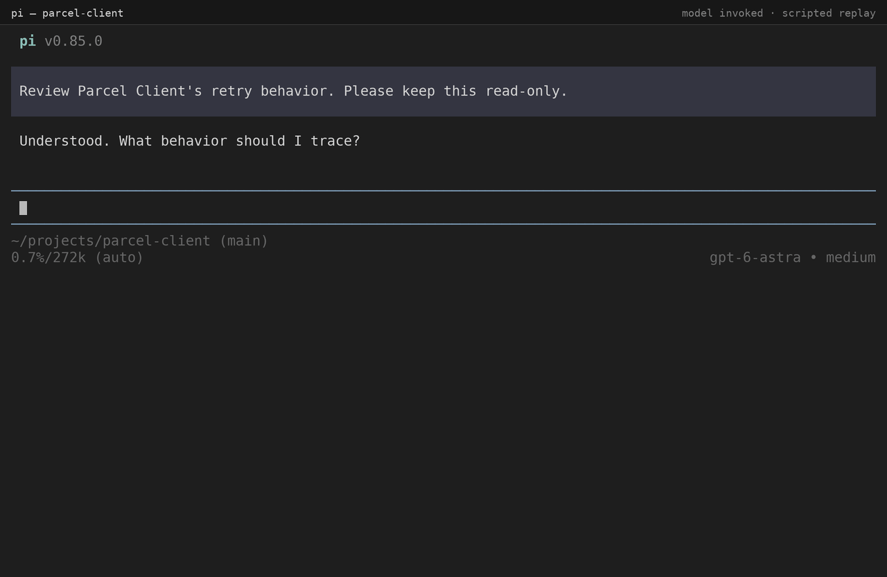

# Pi Subagent

A foreground, model-invocable Pi extension that runs focused local-file or web investigations outside the parent context.

The companion [skill](../../skills/pi-subagent/README.md) guides the parent in deciding when and how to delegate. This extension enforces the runtime boundary, launches the child, reports progress, and returns a bounded result envelope containing the final answer.

[Install](#requirements-and-installation) · [Runtime contract](#runtime-contract) · [Security](#security-boundary) · [Evaluation](#evaluation) · [Verification](#verification)

## In action

An illustrated CLI walkthrough shows Pi Subagent investigating a retry bug in **Parcel Client**, a synthetic shipping client. Dialogue, timing, and usage figures are illustrative rather than a recording of a live model session.

**Model invoked** — the user asks a normal debugging question. Pi decides that a focused investigation is appropriate and delegates it to a scoped, read-only child. You can also invoke `/skill:pi-subagent` explicitly with a focused task and scope; the parent follows the skill guidance and calls the same `pi_subagent` tool.



Both approaches use the same bounded `pi_subagent` runtime. Intermediate child tool output stays out of the parent context; the result returns to the parent for targeted verification and synthesis.

## Requirements and installation

Core requirements:

- Linux, including Ubuntu on WSL; native Windows is not officially supported or tested;
- Pi 1.0.0 or later;
- authentication for the configured child provider and access to its model (`openai-codex` by default; see [Presets](#presets)). Installing this extension does not grant model access.

Capability-specific requirements:

- `local`: `rg` for `grep`, and `fd` or `fdfind` for `find`;
- `web`: [`pi-web-access` v0.33.0 or later (stable releases)](https://github.com/nicobailon/pi-web-access) with its default tool names.

Install the extension and companion skill together from npm:

```bash
pi install npm:@mdgchamomile/pi-subagent
```

For web investigations, also install the web extension (v0.33.0 or later):

```bash
pi install npm:pi-web-access
```

Alternatively, install both components from a checkout. These commands are for a new source installation and stop if either destination already exists, including as a broken symbolic link:

```bash
(
  set -e
  git clone https://github.com/MDGChamomile/pi-subagent.git
  cd pi-subagent
  mkdir -p ~/.pi/agent/extensions ~/.pi/agent/skills

  extension_target="$HOME/.pi/agent/extensions/pi-subagent"
  skill_target="$HOME/.pi/agent/skills/pi-subagent"
  for target in "$extension_target" "$skill_target"; do
    if [ -e "$target" ] || [ -L "$target" ]; then
      printf 'Refusing to replace existing path: %s\n' "$target" >&2
      exit 1
    fi
  done

  ln -s "$PWD/extensions/pi-subagent" "$extension_target"
  ln -s "$PWD/skills/pi-subagent" "$skill_target"
)
```

To update a linked source installation, update the checkout after reviewing its changes; do not rerun the link commands. Use either the npm package or a source installation, not both. Restart Pi or run `/reload` after installation or update.

### First investigation

The model can select the skill automatically. For an explicit first investigation from this repository root, use a scoped request such as:

```text
/skill:pi-subagent Investigate how cancellation terminates child processes within extensions/pi-subagent/. Return conclusions with file and line evidence.
```

The command loads delegation guidance for the parent, which then calls the `pi_subagent` tool. The child investigates only: it does not modify files or run tests, and final verification remains with the parent.

> [!NOTE]
> The web guard verifies the dependency's package name, minimum version (>=0.33.0, stable releases only), declared entry point, and tool provenance. Newer stable versions are allowed without an upper bound so updates are not blocked solely by version; this is not a guarantee of compatibility or package safety. Prereleases and malformed versions are rejected. Existing argument allowlists and execution limits remain enforced, but changes to upstream behavior may require maintenance. Another extension exposing the same tool names does not satisfy the provenance check. Without the web dependency, `local` runs remain available. Local child startup is forced offline and never downloads missing search binaries.

## How it works

1. The parent calls `pi_subagent` with one focused task, a capability, an explicit scope, and a preset.
2. The parent extension canonicalizes the authorized scope and starts one ephemeral `pi --mode json --print --no-session` child process.
3. The child guard validates tool ownership, publishes a private readiness marker, and validates each local or web tool call before execution.
4. The parent-side collector discards intermediate child turns and tool results. After the child exits, the parent verifies readiness before accepting the last valid non-tool assistant answer, sanitizing control characters, and limiting its size.
5. The TUI reports per-call progress and, when settled, the elapsed time and estimated context injected into the parent.

[](assets/pi-subagent-architecture.png)

Collection, control-character sanitization, and result assembly run in the parent extension. Complete/partial calls return bounded answer text and separate host-only metadata; failures return bounded error text. Sanitization does not redact source quotations from the final answer. `--no-session` disables persisted Pi sessions, not in-memory context or private runtime files.

One child call is the default. Each parent agent run allows at most three started child calls in total, whether sequential or parallel. Distinct, independent calls can run in parallel; local and web calls share the same limit and can multiply model, provider, and web-request usage. One corrected retry is allowed only after preflight validation fails; it does not permit a fourth started call.

## Runtime contract

### Capabilities and scope

- `local` loads only Pi-owned `read`, `grep`, `find`, and `ls`. It requires 1-8 existing files or directories inside the parent working directory.
- `web` loads only `web_search`, `source_check`, `fetch_content`, and `get_search_content` from the installed `pi-web-access` package. Its scope must be empty.
- Local and web access never coexist in one child. Mixed-source work uses separate calls and parent-side synthesis.
- A bare `@` is rejected rather than expanding to the parent working directory.
- The child cannot write files, run Bash or tests, inspect sessions, recurse, run in the background, persist a child session, or load discovered extensions, Skills, prompt templates, context files, themes, or project trust.

### Presets

Each standard preset selects a child model without changing the main model's thinking level. The default provider/model and thinking for each preset are listed in the [README](../../README.md#presets).

Run **`/pi-subagent-settings`** in TUI mode to configure persistent user defaults. Select a preset, provider, model, and supported thinking level in searchable, height-bounded lists. Type to filter by ID or display name; use arrow keys to scroll. The current setting is marked; Escape goes back a selection step (or exits the first) and Ctrl+C cancels. Review the before/after values and confirm to save; cancelling leaves the file unchanged. Providers and models are filtered using Pi's local authentication metadata, which does not guarantee account access or child availability. Other registered models can still be configured in the settings file; RPC and non-interactive clients should use that file too. This is a user command, not a model-callable tool; it never changes the parent model or thinking level or makes a provider request.

The command reads and writes `pi-subagent.json` in Pi's user agent directory, resolved with `getAgentDir()` (`~/.pi/agent` by default, or `PI_CODING_AGENT_DIR`). You can also edit this optional JSON file directly. Settings are read before each call, so saved defaults apply to future calls across sessions without a reload, not to already-running children. Project settings and tool arguments cannot select providers/models.

Only the selected preset is updated; other overrides remain intact and omitted defaults are not materialized. Invalid JSON or settings are not overwritten. Saving uses a private temporary file and atomic replacement, rejects symlink/non-file targets, and serializes command writers with an exclusive `.lock` file. Changes detected since opening the dialog require reopening rather than overwriting. Non-cooperating external editors do not share that lock; avoid editing simultaneously. A crash can leave a `.lock` file: check that no writer is active before manually removing it. Non-UI modes must edit JSON directly.

```json
{
  "presets": {
    "lookup-standard": { "thinking": "low" },
    "analysis-standard": {
      "provider": "anthropic", "model": "claude-sonnet-4-5", "thinking": "high"
    },
    "review-standard": {
      "provider": "openrouter", "model": "anthropic/claude-sonnet-4.5", "thinking": "high"
    }
  }
}
```

Omitted presets and fields retain their defaults. To change a model, specify both `provider` and `model`; model IDs may include `@`, slashes (as on OpenRouter), and colons (as on Ollama). IDs must be nonempty, at most 256 characters, free of control characters, and have no surrounding whitespace; their spelling is preserved. A thinking-only override is allowed. Accepted thinking names are `off`, `minimal`, `low`, `medium`, `high`, `xhigh`, and `max`; the selected model must support the level according to Pi's metadata. Pi maps these names to each provider's own reasoning controls, so they are not identical token budgets across providers. Unknown fields, malformed settings, unavailable models, and unsupported levels fail during preflight with configuration guidance, not a fallback or silent clamp.

Use exact model IDs present in your Pi registry and authenticate through Pi's usual login/environment configuration. Examples do not guarantee account access. Pi 1.0.0's bundled catalog includes the default `gpt-6-luna` and `gpt-6.1-sol` models, but you still need access to the selected model; configure another available model if necessary. This package does not install models, store credentials, or change the parent model/thinking. Built-in providers such as Anthropic and OpenRouter and user `models.json` configurations are supported; providers requiring parent-only extensions are not, because child extension discovery stays disabled. The child verifies its effective provider/model and thinking before each provider request; disagreement with the selected settings fails closed before transmission.

Selecting a provider changes where delegated inputs are sent and may incur its charges. Review those settings and your provider permissions before delegating. There is no automatic provider fallback or per-call approval UI. The settings command confirms only the saved defaults, not future provider usage.

### Result and lifecycle

The runtime applies these per-child limits:

| Limit | `local` | `web` |
| --- | --- | --- |
| Investigation deadline | 18 minutes, then a 2-minute text-finalization window within the 20-minute hard limit | Same |
| Tool-call budget | Warn at 36 attempts; stop before attempt 49 | Warn at 30 attempts; stop before attempt 41 |
| Executed web queries | — | Warn at 24 reserved queries; limit 32 |
| Executed fetch/content targets | — | Warn at 38 reserved targets; limit 50 |
| Final answer | 12 KiB | 12 KiB |
| Captured JSON record | 6 MiB | 6 MiB |

The JSON record cap accommodates Pi's default 4.5 MiB base64 image payload plus text and metadata. Larger `message_end` records still fail closed; this is not an unlimited or arbitrary multi-image response allowance. Intermediate image content is discarded, not returned to the parent.

- The parent accepts a final answer only after the child guard validates policy and tool ownership and publishes its readiness marker.
- Intermediate assistant turns and investigation tool results are discarded. The collector retains only the last assistant message containing non-empty text without a tool call or terminal model error, then sanitizes and bounds it.
- A tool-only or token-limited ending gets at most one tool-disabled finalization follow-up. Model errors and aborted turns do not trigger this fallback; Pi owns automatic retry decisions, and existing deadline and tool-budget limits remain enforced. A zero-exit child that still has no final answer is rejected.
- The collapsed call title shows `pi_subagent` and a task preview capped at 100 terminal columns; the entire title is further truncated to fit one row in narrower terminals. Scope and other inputs are hidden. Expanding the row reveals the full task, scope, capability, and preset as JSON-escaped values. This affects display only, not execution inputs or scope enforcement.
- Each running call reports `mm:ss · model (thinking) running · N reported tokens` once per second. A settled row reports `✓ Complete · 14.2s · Context injected: ~1,820 tokens`, or `⚠ Partial`; expanding it reveals the result envelope and answer. If the runtime byte cap shortened the answer, both views also show an `Output truncated` warning. Truncation does not change the child's complete/partial execution status.
- Answers received by the parent during the text-finalization window are labelled `partial` with `partialReason: "time_limit"`. The receipt time of the last eligible answer determines this label, not the child's timestamp or subsequent shutdown duration; termination still starts at the hard deadline. Cancellation, timeout, a child JSON protocol error, or a failed progress callback sends SIGTERM to the process group, then SIGKILL after a 5-second grace period unless a POSIX probe confirms that the entire group has disappeared. Probes run at intervals of up to 100 ms; permission errors and other uncertain results retain the grace period and escalation. A failed first progress update stops the child before the investigation prompt is delivered; later progress failures stop the ongoing investigation. The parent returns a `progress` failure after cleanup, without forwarding callback error text. Already-issued provider requests may still incur usage. The direct child's exit alone does not end the wait when descendants may survive, so shutdown can extend beyond the investigation deadline. Normal completion does not add this wait.
- If the last answer still has `stopReason: "length"`, its available text is returned as `partial` with `partialReason: "model_length"`, never as complete. This reason takes precedence over a simultaneous budget or time limit. `outputTruncated` continues to report only truncation by the runtime's byte cap.
- Allowed and denied tool attempts both count. A soft warning leaves later calls available; a hard stop disables tools, reuses text finalization, and returns a `partial` result with `partialReason: "tool_budget"`.
- Web calls reserve their full cost synchronously during sequential Pi tool preflight, before parallel execution: `web_search` charges its normalized `query`/`queries`; `source_check` charges its effective queries and, with `fetchContent: true`, conservatively up to five result pages (`min(5, queries × results per query)`); `fetch_content` charges its normalized unique `url`/`urls`; and each `get_search_content` retrieval charges one content target. A batch that would cross either limit does not execute or consume query/fetch counters. It also starts tool-disabled finalization, so later calls cannot spend the remaining budget. A returned answer is `partial` with `partialReason: "tool_budget"` unless the higher-priority `model_length` reason applies; finalization can still fail instead of returning an answer. Each resource gets one soft warning after an admitted reservation first reaches or crosses its warning threshold, reporting reserved and remaining counts without queries or URLs. These notices do not disable tools or mark the result partial; the existing tool-attempt warning and hard limits remain unchanged.
- A dedicated parent-liveness pipe makes the child remove private runtime files and terminate its POSIX process group if the parent exits abruptly. The implementation has a native-Windows fallback that terminates the child process itself, but native Windows is not officially supported or tested.
- Final diff, audit, test, and retrieval validation stays with the parent when it holds the edited files or may need to make follow-up fixes.

Only the bounded result text (`content`) enters the parent model context. Every successful call returns this JSON envelope:

| Field | Meaning |
| --- | --- |
| `status` | Runtime-owned `complete` or `partial` execution status |
| `partialReason` | `null`, `tool_budget`, `time_limit`, or `model_length` |
| `outputTruncated` | Whether the runtime byte cap shortened the answer |
| `answer` | Untrusted child answer text |

JSON escaping keeps literal markers, quotes, and forged envelope text inside `answer`, not in the runtime fields. The whole serialized envelope, including escaping overhead, fits within the 12 KiB cap and determines the injected-context estimate. That estimate is its UTF-8 byte length divided by four, rounded up: a model-independent size heuristic, not measured tokens or a guaranteed error bound across languages and models. Byte truncation shortens `answer` at a UTF-8 boundary while preserving valid JSON and the runtime fields; it adds no in-body status marker. This separates status provenance but does not make the answer trustworthy or prevent all model-level prompt injection.

Parent tool-result `details` retain content-free execution and budget metadata for the UI and host, such as the selected capability, preset, model, scope-root count, status, duration, usage, limit-status flags, and counters. They are not sent to the parent model and never include tasks, queries, URLs, paths, or tool content.

## Security boundary

### Local runs

The child guard canonicalizes every requested path, replaces the tool input with that authorized canonical path, and blocks paths outside the explicit scope, including lexical, absolute, and symlink escapes. It independently verifies that every enabled local tool is Pi-owned. Local children do not inherit `RIPGREP_CONFIG_PATH`, preventing user-configured options such as `--follow` from widening recursive grep searches beyond the authorized scope; the parent's environment is unchanged. Local runs do not resolve or load the web extension.

### Web runs

The web extension loads before the guard, making the guard the final `tool_call` policy handler. Every web tool uses a pinned, default-deny argument allowlist:

- searches are non-interactive, use the configured provider, disable curation and background content expansion, and allow at most four queries with ten results each;
- fetches allow at most five readable HTTP(S) URLs under the web extension's SSRF policy; omitted modes are explicitly set to `readable`, regardless of the web extension's default mode (its allowed-mode restrictions still apply);
- caller-selected providers or proxies, local files, browser-cookie authentication, answer/model/media modes, embedded URL credentials, and forced GitHub clones are rejected.

An input rejected by argument validation blocks only that call, allowing the child to correct it. Every corrected call is validated independently. Lifetime budget exhaustion instead starts finalization, as described in [Result and lifecycle](#result-and-lifecycle).

### Trust model and data flow

Before every provider request, the child requires successful guard initialization, tool ownership validation, and readiness publication in addition to the selected model/thinking. Startup failure stops the child before transmission; the parent also independently requires the readiness marker before accepting any answer. Errors returned to the parent are control-character-sanitized and capped at 4 KiB; failure diagnostics omit tasks, paths, assistant text, and tool-result contents. Unexpected process-exit diagnostics include whether a valid guard readiness marker was observed (`guardReady`) and the exit code or termination signal (`exitSignal`). An absent or invalid marker does not by itself identify the cause of failure. Guard-owned exit codes distinguish `initialization` (70), `toolOwnership` (71), `readiness` (72), `modelSelection` (73), and `runtime` (74) failures using fixed, content-free parent messages. A budget-notice or final-answer message failure after readiness is a `runtime` failure; subsequent provider requests remain blocked. Child stderr is discarded, while reported child usage is attached to the parent tool result on success and failure.

Failures after collector creation also include model-visible `observations` in the existing bounded error suffix; they are not host-only details. The parent retains fixed `counts` for validated `turn_start`, assistant `message_update`, tool execution start/end, and automatic retry start/end events. Separate `receipts` count recognized allowlisted type prefixes, even for oversized or malformed records; these do not imply valid events. `lastEvent`, its age on the parent's monotonic receipt clock, and `lastEventValidated` distinguish unvalidated receipt from a validated event. For Pi's type-first records, only 4 KiB is captured for inspection; larger payloads are discarded while their prefix receipt remains observable. Non-type-first records still follow the existing bounded JSON fallback, but cannot contribute validated observations above 4 KiB. Counters saturate at 1,000,000. Oversized or malformed selected records, invalid event structure, excess tool ends, saturation, and a JSON protocol failure mark observations `incomplete`; after a protocol failure no further events are accepted. An empty observation set is possible on spawn/setup failures. Preflight failures have no collector observations. Complete and partial returns discard these diagnostics, and no additional persistent log is created.

These are untrusted stream observations, not a verified execution trace: IDs are not retained or paired. `toolBalance` is the nonnegative difference between validated starts and ends, or `null` whenever observations are incomplete; it is never proof of active tools. Pi's JSON `message_update` records are delta-only, but block-end updates carry the completed text, thinking, or tool call, and tool ends contain full results, so records over 4 KiB are routine. Their receipts remain visible, but cannot establish execution or completion; missing events can still hide progress. A tool start without an observed end differs from an observed end followed by assistant streaming, but neither identifies the cause of a stall or confirms when a provider request was sent. Child timestamps, text/thinking, arguments/results, names, IDs, URLs, paths, and raw provider errors are never copied into the new observations. The existing 6 MiB answer-record cap and 4 KiB total failure-error cap remain unchanged.

The delegated task, scope path names, local-file contents read by the child, and retrieved web content enter the configured child model provider's context. Web queries and requested URLs also go to the applicable search/fetch services. The final answer returns to the parent and enters its model context. The trusted web extension may maintain its documented bounded cache or temporary files.

This is an application-level capability boundary, not an OS or network sandbox. The child and trusted web extension still run as the current user. The `web` capability restricts the available tool names and arguments; it does not guarantee anonymous, public-only target access or isolate host GitHub, Git, SSH, or browser credentials that the trusted web extension may use. Do not use it for untrusted workloads requiring host isolation or for secrets that must not be sent to configured providers.

## Evaluation

> [!CAUTION]
> The context evaluation starts fresh parent and child model sessions, sends the synthetic fixtures to the configured provider, and consumes model usage. Obtain authorization before running it. The default three-case run starts six parent sessions, with one child session in each delegated arm; a session may make more than one provider request.

From the repository root, specify an available parent model and thinking level explicitly:

```bash
python3 extensions/pi-subagent/scripts/context_isolation_eval.py \
  --mode context \
  --main-model openai-codex/gpt-6-astra \
  --main-thinking medium
```

The command compares direct and delegated investigation against three fixed synthetic fixtures. Outcomes are not deterministic; use it as a bounded sanity check rather than durable performance evidence. If both `PI_PROVIDER` and `PI_MODEL` are set, the script can derive the parent model when `--main-model` is omitted, but explicit arguments are preferred for reproducibility.

Earlier benchmark material is kept in the [repository history](https://github.com/MDGChamomile/pi-subagent/tree/3cf3ece9dcedd7c686d42c37ca91eabd7b9ecb9f/extensions/pi-subagent/benchmark-v2), not in the current source: the unexecuted confirmatory [benchmark design](https://github.com/MDGChamomile/pi-subagent/blob/3cf3ece9dcedd7c686d42c37ca91eabd7b9ecb9f/extensions/pi-subagent/benchmark-v2/README.md) and its [offline evidence evaluator](https://github.com/MDGChamomile/pi-subagent/blob/3cf3ece9dcedd7c686d42c37ca91eabd7b9ecb9f/extensions/pi-subagent/benchmark-v2/OFFLINE_SCORING.md), a [12-task production-preset exploratory pilot](https://github.com/MDGChamomile/pi-agent-kit/blob/6770d67511ab19727164b1ea8d565c9bed2a6609/live/extensions/pi-subagent/benchmark-v2/pilots/2026-09-01-production-12-task/REPORT.md), and a [46-child Astra routing pilot](https://github.com/MDGChamomile/pi-subagent/blob/3cf3ece9dcedd7c686d42c37ca91eabd7b9ecb9f/extensions/pi-subagent/benchmark-v2/pilots/2026-09-05-astra-routing/REPORT.md) with its frozen-protocol runner, [`scripts/model_selection_eval.py`](https://github.com/MDGChamomile/pi-subagent/blob/3cf3ece9dcedd7c686d42c37ca91eabd7b9ecb9f/extensions/pi-subagent/scripts/model_selection_eval.py). The 12-task pilot found substantially lower parent-context growth with delegation, but wall time increased and the provisional quality measure favored direct investigation, so it does not establish quality non-inferiority. The routing pilot recommended retaining the then-current Luna/Terra/Sol medium mappings. Both are calibration results from one local codebase, not universal performance claims.

## Verification

Offline checks from the repository root (dependency installation may access npm; the checks make no model requests):

```bash
npm --prefix extensions/pi-subagent ci --include=dev --ignore-scripts
npm --prefix extensions/pi-subagent run typecheck
npm --prefix extensions/pi-subagent test
npm --prefix extensions/pi-subagent run package:check
```

Opt-in local smoke, only with authorization for model/provider usage:

```bash
python3 -B extensions/pi-subagent/scripts/context_isolation_eval.py \
  --mode smoke --capability local --preset all \
  --main-model openai-codex/gpt-6-astra --main-thinking medium
```

The live observation harness is Codex-specific and evaluates default presets, not arbitrary provider overrides. Use a dedicated Pi agent directory without `pi-subagent.json` for these opt-in commands. Offline configuration tests cover Anthropic/OpenRouter selection; they do not establish live provider compatibility.

The development dependencies are pinned to Pi 1.0.0, the declared minimum. The default offline suite includes Python evaluation-contract tests as well as the TypeScript runtime tests; Python 3 and `rg` are required. The scoped-search regression uses Pi's native grep tool and an existing ripgrep binary without downloading tools or making model requests. Live checks require the Node.js Pi installation and consume model/provider usage. `--preset all` (the default) runs every current runtime preset in a fresh parent session; select one with, for example, `--preset review-standard`. If both `PI_PROVIDER` and `PI_MODEL` are set, `--main-model` may be omitted, but explicit parent model and thinking arguments are preferred for reproducibility.

Live checks verify the requested preset/capability/scope, returned model/thinking, complete untruncated output, usage, evidence, and absence of parent investigation. A test-only observer loads before the production guard and independently checks the effective child model/thinking, outgoing model/reasoning fields, and returned model identity. It records only configuration metadata in temporary files, never prompts, response text, headers, or credentials. The observer does not block requests: the evaluator checks every recorded request after the run, while the production guard independently blocks effective model/thinking mismatches before transmission. A wire-payload mismatch can therefore be detected only after a request has occurred. Missing observations and silent thinking clamping fail the check. It does not change production presets or global model configuration.

The web smoke is a source-checkout test. It uses the checked-in `scripts/web-smoke-parent.ts` helper, not a personal loader. Install and review a compatible `pi-web-access` package separately, with authorization, then locate its declared extension entry file in that package's `package.json` (`pi.extensions`). Pass the actual existing entry file explicitly; npm, git, and custom installation locations work without a fixed agent-directory layout. No dependency is downloaded by the smoke script.

With authorization for the model/provider usage described above:

```bash
python3 -B extensions/pi-subagent/scripts/context_isolation_eval.py \
  --mode smoke --capability web --preset all \
  --web-extension /path/to/pi-web-access/index.ts \
  --main-model openai-codex/gpt-6-astra --main-thinking medium
```

Replace `/path/to/pi-web-access/index.ts` with your package's declared entry file. A missing `--web-extension` or non-file path fails before any model session starts. Local smoke does not require or resolve this option. The source-only helper is not installed into the active Pi environment and is not included in the npm package.

The helper loads last in the parent, keeps `pi-web-access` tools registered with their original provenance, activates only `pi_subagent`, and blocks other parent tool calls. The helper is not loaded in the child; the existing test observer and production guard remain in place, and package/version/entry-point checks are unchanged. No CLI tool allowlist is applied to the web-smoke parent, because Pi would remove the web tools from its registry rather than merely hiding them from the model. The smoke fetches IANA's example-domain documentation without searching, requires a test-only observation of a successful single-target `fetch_content` call with nonempty content, requires verbatim body evidence for both the documentation purpose and registration/transfer restriction, and fails on any parent investigation or loader call. The fetch observation records only target-match and success booleans, never URLs, content, or credentials; this does not expand production telemetry. Offline tests verify command assembly, early failures, and helper behavior; live provider/web compatibility requires a separately authorized smoke run.

The default offline suite covers final-answer isolation, complete and partial outcomes, tool-disabled finalization, empty answers, bounded provider errors, cancellation, timeout escalation, abrupt parent exit, usage aggregation, scope, recoverable web denials, and tool ownership. `provider-guard.test.ts` also runs a real SDK session through the built-in `openai-codex-responses` SSE implementation, using synthetic in-memory OAuth-shaped data and a stubbed fetch response. It verifies actual provider `onPayload` delivery to `before_provider_request`, a successful parsed response, and synchronous guard exit before fetch on model/thinking mismatch. A throwing-hook control verifies that ordinary hook exceptions are swallowed rather than reliably blocking transmission. The isolated fixture replaces HOME and resource paths and blocks network socket attempts; it neither reads real credentials nor calls a provider. This tests only the default Codex API's SSE path, not WebSocket, other providers, live compatibility, or the full CLI subprocess path. The existing default test glob includes it in pinned validation and in the scheduled canary when the change reaches its checkout branch; no canary run is implied by a local pass. Opt-in smoke tests cover live model selection and the local/web runtime boundaries.
